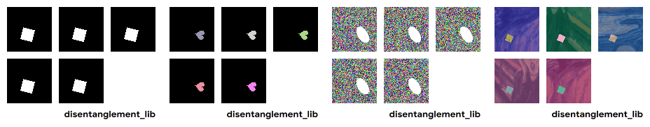

dSprites
========

.. raw:: html

   

   
   
   
   

Overview
--------

The dSprites dataset is a synthetic benchmark designed for **disentangled and unsupervised representation learning**. It consists of procedurally generated 2D shapes rendered under controlled and fully known generative factors.

The dataset contains **all possible combinations** of six latent factors of variation, with each combination appearing exactly once. This complete Cartesian product structure makes dSprites a standard benchmark for evaluating disentanglement, factor predictability, and interpretability of learned representations.

In stable-datasets, dSprites is exposed via the ``DSprites`` class, with **four variants** selectable via ``config_name``:

- **Total images**: 737,280 per variant
- **Image resolution**: 64x64 (original) or 64x64x3 (color, noise, scream)

Variants
--------

.. list-table::
   :header-rows: 1
   :widths: 15 15 55

   * - Variant
     - Image Mode
     - Description
   * - ``original``
     - Grayscale
     - Binary black-and-white images (default)
   * - ``color``
     - RGB
     - Object rendered with a random RGB color on a black background
   * - ``noise``
     - RGB
     - White object on a random-noise background
   * - ``scream``
     - RGB
     - Object rendered by inverting pixels on a random Scream painting patch

Latent Factors of Variation
---------------------------

All variants share the same six independent latent factors:

.. list-table::
   :header-rows: 1
   :widths: 20 30 30

   * - Factor
     - Discrete Values
     - Continuous Values
   * - ``color``
     - {0}
     - 1.0 (fixed, white)
   * - ``shape``
     - {0, 1, 2}
     - {1.0, 2.0, 3.0} (square, ellipse, heart)
   * - ``scale``
     - {0, ..., 5}
     - Linearly spaced in [0.5, 1.0]
   * - ``orientation``
     - {0, ..., 39}
     - Uniform in [0, 2pi] radians
   * - ``posX``
     - {0, ..., 31}
     - Normalized position in [0, 1]
   * - ``posY``
     - {0, ..., 31}
     - Normalized position in [0, 1]

Data Structure
--------------

When accessing an example using ``ds[i]``, you will receive a dictionary with the following keys:

.. list-table::
   :header-rows: 1
   :widths: 25 20 55

   * - Key
     - Type
     - Description
   * - ``image``
     - ``PIL.Image.Image``
     - 64x64 (grayscale) or 64x64x3 (RGB) image
   * - ``label``
     - ``List[int]``
     - Discrete latent indices: ``[color, shape, scale, orientation, posX, posY]``
   * - ``label_values``
     - ``List[float]``
     - Continuous latent values corresponding to ``label``
   * - ``color`` ... ``posY``
     - ``int``
     - Individual discrete latent factors
   * - ``colorValue`` ... ``posYValue``
     - ``float``
     - Individual continuous latent values
   * - ``colorRGB``
     - ``List[float]``
     - Actual RGB color applied to the object (**color variant only**)

Usage Example
-------------

**Basic Usage (original variant)**

.. code-block:: python

    from stable_datasets.images import DSprites

    # Default variant is "original"
    ds = DSprites(split="train", config_name="original")

    sample = ds[0]
    print(sample.keys())

    image = sample["image"]       # PIL.Image (64x64 grayscale)
    factors = sample["label"]     # [color, shape, scale, orientation, posX, posY]

    # Optional: make it PyTorch-friendly
    ds_torch = ds.with_format("torch")

**Color variant**

.. code-block:: python

    from stable_datasets.images import DSprites

    ds = DSprites(split="train", config_name="color")

    sample = ds[0]
    image = sample["image"]         # PIL.Image (64x64x3 RGB)
    color_rgb = sample["colorRGB"]  # [R, G, B] in [0.5, 1.0]

**Noise variant**

.. code-block:: python

    from stable_datasets.images import DSprites

    ds = DSprites(split="train", config_name="noise")

    sample = ds[0]
    image = sample["image"]  # PIL.Image (64x64x3, noisy background)

**Scream variant**

.. code-block:: python

    from stable_datasets.images import DSprites

    ds = DSprites(split="train", config_name="scream")

    sample = ds[0]
    image = sample["image"]  # PIL.Image (64x64x3, Scream painting background)

Why No Train/Test Split?
------------------------

The dSprites dataset does not define an official train/test split.
It is intended for **representation learning research**, where models are trained to capture underlying factors of variation rather than to generalize across semantic classes.

Because the dataset is a complete Cartesian product of all factor combinations, common evaluation protocols rely on:

- Factor-wise generalization
- Metric-based disentanglement scores
- Controlled interventions on latent variables

References
----------

- Dataset repository: https://github.com/google-deepmind/dsprites-dataset
- Disentanglement library: https://github.com/google-research/disentanglement_lib/
- License: zlib/libpng License (original), Apache License 2.0 (color/noise/scream)

Citations
---------

.. code-block:: bibtex

    @inproceedings{higgins2017beta,
      title={beta-vae: Learning basic visual concepts with a constrained variational framework},
      author={Higgins, Irina and Matthey, Loic and Pal, Arka and Burgess, Christopher and
              Glorot, Xavier and Botvinick, Matthew and Mohamed, Shakir and Lerchner, Alexander},
      booktitle={International Conference on Learning Representations},
      year={2017}
    }

.. code-block:: bibtex

    @inproceedings{locatello2019challenging,
      title={Challenging Common Assumptions in the Unsupervised Learning of Disentangled Representations},
      author={Locatello, Francesco and Bauer, Stefan and Lucic, Mario and
              Raetsch, Gunnar and Gelly, Sylvain and
              Sch{\"o}lkopf, Bernhard and Bachem, Olivier},
      booktitle={International Conference on Machine Learning},
      pages={4114--4124},
      year={2019}
    }
