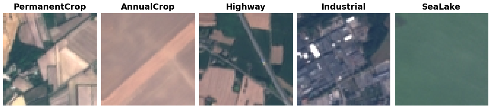

EuroSAT
=======

.. raw:: html

   

   
   
   
   

Overview
--------
EuroSAT is a land use and land cover classification benchmark built from Sentinel-2 satellite imagery. The RGB version contains 27,000 labeled 64×64 JPEG patches across 10 classes covering crops, forest, vegetation, industrial, residential, water, and transport categories.

The original release does not ship an official split. This builder uses the widely adopted ``google-research/remote_sensing_representations`` split (16,200 train / 5,400 validation / 5,400 test), as mirrored by the ``timm/eurosat-rgb`` HuggingFace dataset in Parquet form.

- **Train**: 16,200 images
- **Validation**: 5,400 images
- **Test**: 5,400 images

Classes (total 27,000 images)
-----------------------------

.. list-table::
   :header-rows: 1
   :widths: 30 20 50

   * - Class
     - # Images
     - Description
   * - ``AnnualCrop``
     - 3,000
     - Fields cultivated annually
   * - ``Forest``
     - 3,000
     - Forest cover
   * - ``HerbaceousVegetation``
     - 3,000
     - Grasslands and other herbaceous cover
   * - ``Highway``
     - 2,500
     - Highways and major roads
   * - ``Industrial``
     - 2,500
     - Industrial buildings / sites
   * - ``Pasture``
     - 2,000
     - Pasture land
   * - ``PermanentCrop``
     - 2,500
     - Permanent crops (e.g. orchards, vineyards)
   * - ``Residential``
     - 3,000
     - Residential buildings
   * - ``River``
     - 2,500
     - Rivers
   * - ``SeaLake``
     - 3,000
     - Seas and lakes

Data Structure
--------------

When accessing an example using ``ds[i]``, you will receive a dictionary with the following keys:

.. list-table::
   :header-rows: 1
   :widths: 20 20 60

   * - Key
     - Type
     - Description
   * - ``image``
     - ``PIL.Image.Image``
     - 64×64×3 RGB image
   * - ``label``
     - int
     - Class label (0-9)

Usage Example
-------------

**Basic Usage**

.. code-block:: python

    from stable_datasets.images.eurosat import EuroSAT

    ds_train = EuroSAT(split="train")
    ds_val = EuroSAT(split="validation")
    ds_test = EuroSAT(split="test")

    sample = ds_train[0]
    print(sample.keys())  # {"image", "label"}

    # Optional: make it PyTorch-friendly
    ds_torch = ds_train.with_format("torch")

References
----------

- Official repository: https://github.com/phelber/EuroSAT
- License: MIT License

Citation
--------

.. code-block:: bibtex

    @article{helber2019eurosat,
      title={Eurosat: A novel dataset and deep learning benchmark for land use and land cover classification},
      author={Helber, Patrick and Bischke, Benjamin and Dengel, Andreas and Borth, Damian},
      journal={IEEE Journal of Selected Topics in Applied Earth Observations and Remote Sensing},
      year={2019},
      publisher={IEEE}
    }
