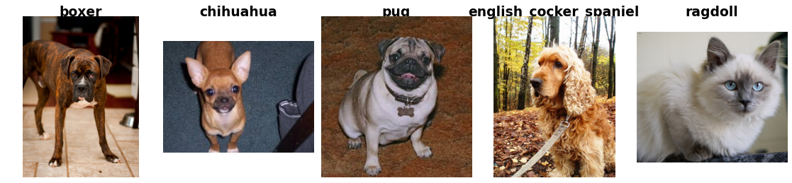

Oxford-IIIT Pet
===============

.. raw:: html

   

   
   
   
   

Overview
--------
The Oxford-IIIT Pet dataset is a 37-category pet image dataset with roughly 200 images per class, covering 12 cat breeds and 25 dog breeds. Images exhibit large variations in scale, pose, and lighting. The dataset ships with an official train/test split used in the original paper: 3,680 training images and 3,669 test images, for a total of 7,349 images. Image resolutions vary across samples. No resizing is applied by default.

- **Train**: 3680 images
- **Test**: 3669 images

Data Structure
--------------

When accessing an example using ``ds[i]``, you will receive a dictionary with the following keys:

.. list-table::
   :header-rows: 1
   :widths: 20 20 60

   * - Key
     - Type
     - Description
   * - ``image``
     - ``PIL.Image.Image``
     - H×W×3 RGB image
   * - ``label``
     - int
     - Breed label (0-36)

Usage Example
-------------

**Basic Usage**

.. code-block:: python

    from stable_datasets.images.oxford_pet import OxfordPet

    # First run will download + prepare cache, then return the split as a HF Dataset
    ds = OxfordPet(split="train")

    # If you omit the split (split=None), you get a DatasetDict with all available splits
    ds_all = OxfordPet(split=None)

    sample = ds[0]
    print(sample.keys())  # {"image", "label"}

    # Optional: make it PyTorch-friendly
    ds_torch = ds.with_format("torch")

References
----------

- Official website: https://www.robots.ox.ac.uk/~vgg/data/pets/
- License: Creative Commons Attribution-ShareAlike 4.0 International License

Citation
--------

.. code-block:: bibtex

    @InProceedings{parkhi12a,
      author       = "Omkar M. Parkhi and Andrea Vedaldi and Andrew Zisserman and C. V. Jawahar",
      title        = "Cats and Dogs",
      booktitle    = "IEEE Conference on Computer Vision and Pattern Recognition",
      year         = "2012",
    }
