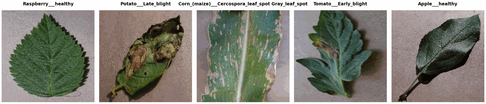

PlantVillage
============

.. raw:: html

   

   
   
   
   

Overview
--------
The PlantVillage dataset is an open-access repository of roughly 54,000 leaf images covering 14 crop species and 26 plant diseases (plus healthy controls), for 38 classes in total. Each image is labelled with a ``Crop___Disease`` class name (e.g. ``Apple___Apple_scab``, ``Tomato___healthy``). The dataset is distributed in three variants — original ``color`` photographs, ``grayscale`` conversions, and ``segmented`` (background-removed) images — and each variant ships with a published ~80/20 train/test split that respects per-leaf grouping to avoid leakage.

Variants
--------

Select a variant with the ``config_name`` argument.

.. list-table::
   :header-rows: 1
   :widths: 18 12 18 18 34

   * - Variant
     - Classes
     - Train
     - Test
     - Description
   * - ``color``
     - 38
     - 43,596
     - 10,709
     - Original RGB leaf photographs (default)
   * - ``grayscale``
     - 38
     - 43,203
     - 11,102
     - Grayscale conversions of the color images
   * - ``segmented``
     - 38
     - 42,984
     - 11,322
     - Leaves segmented from the background

Data Structure
--------------

When accessing an example using ``ds[i]``, you will receive a dictionary with the following keys:

.. list-table::
   :header-rows: 1
   :widths: 20 20 60

   * - Key
     - Type
     - Description
   * - ``image``
     - ``PIL.Image.Image``
     - H×W×3 RGB image
   * - ``label``
     - int
     - Class label (0-37); use ``ds.features["label"].int2str(label)`` to recover ``Crop___Disease``
   * - ``crop``
     - str
     - Crop name (e.g. ``Apple``, ``Tomato``, ``Pepper,_bell``)
   * - ``disease``
     - str
     - Disease name or ``healthy`` (e.g. ``Apple_scab``, ``Late_blight``)

Usage Example
-------------

**Basic Usage**

.. code-block:: python

    from stable_datasets.images.plant_village import PlantVillage

    # Default variant is "color"
    ds = PlantVillage(split="train")

    # Select a different variant explicitly
    ds_gray = PlantVillage(split="train", config_name="grayscale")
    ds_seg = PlantVillage(split="test", config_name="segmented")

    # All splits at once
    ds_all = PlantVillage(split=None, config_name="color")

    sample = ds[0]
    print(sample.keys())  # {"image", "label", "crop", "disease"}
    print(sample["crop"], sample["disease"])

    # Optional: make it PyTorch-friendly
    ds_torch = ds.with_format("torch")

References
----------

- Official repository: https://github.com/spMohanty/PlantVillage-Dataset
- License: CC0 1.0 (public domain)

Citation
--------

.. code-block:: bibtex

    @article{hughes2015open,
      title={An open access repository of images on plant health to enable the development of mobile disease diagnostics},
      author={Hughes, David P. and Salath{\'e}, Marcel},
      journal={arXiv preprint arXiv:1511.08060},
      year={2015}
    }

    @article{mohanty2016using,
      title={Using deep learning for image-based plant disease detection},
      author={Mohanty, Sharada P. and Hughes, David P. and Salath{\'e}, Marcel},
      journal={Frontiers in Plant Science},
      volume={7},
      pages={1419},
      year={2016}
    }
